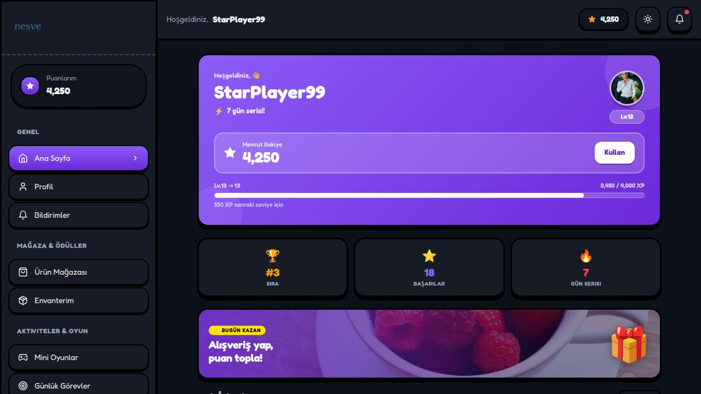
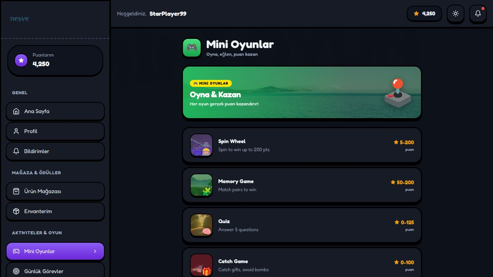
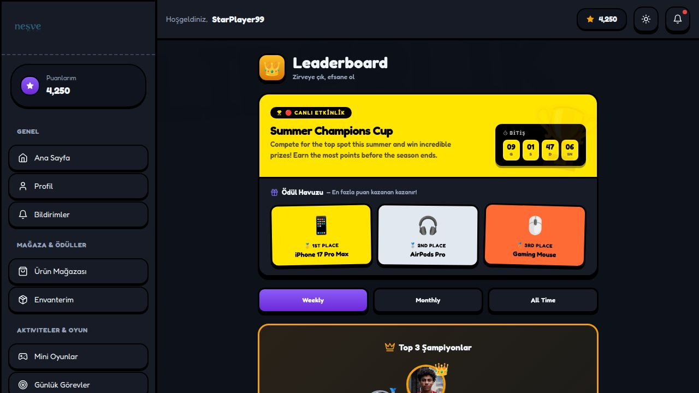
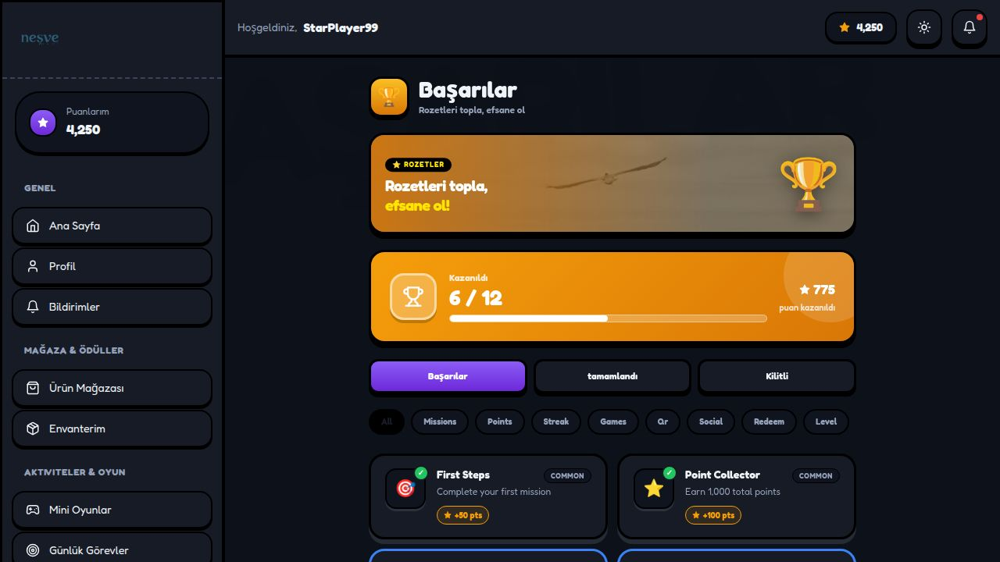
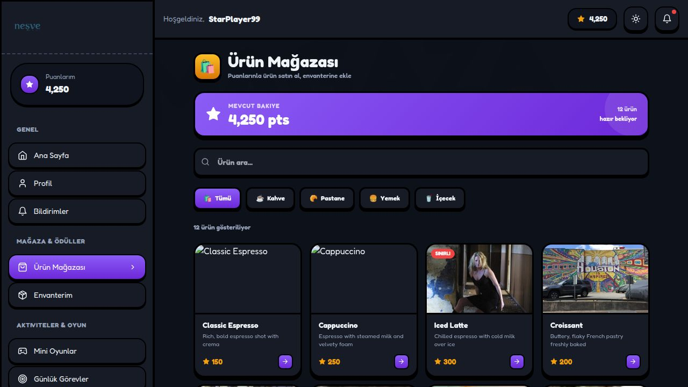
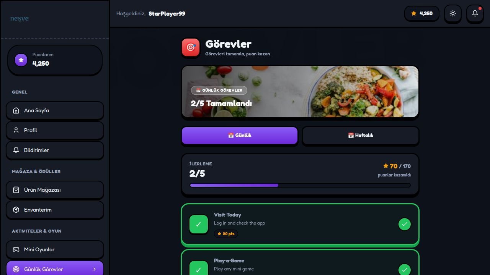
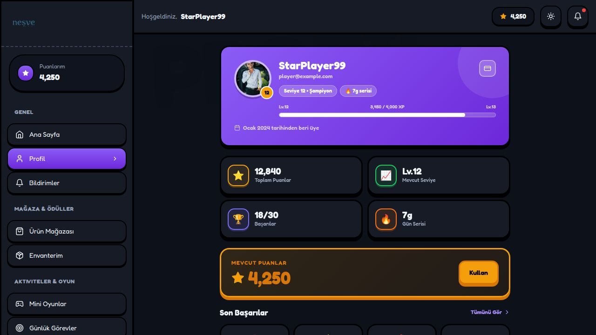

# NexReward — Gamified Loyalty Platform


**NexReward** is a full-featured Turkish gamified loyalty web application. Users earn points through shopping, playing mini-games, and completing daily missions. They can redeem points in the rewards shop, compete on leaderboards, unlock achievements, and track their progress through levels.

---

## Table of Contents

1. [Technology Stack](#technology-stack)
2. [Project Structure](#project-structure)
3. [Key Features](#key-features)
4. [Screenshots — Dark Mode](#screenshots--dark-mode)
5. [Screenshots — Light Mode](#screenshots--light-mode)
6. [Important Code Explained](#important-code-explained)
7. [Routing Map](#routing-map)
8. [Running the Project](#running-the-project)
9. [Export to PDF or Word](#export-to-pdf-or-word)

---

## Technology Stack

| Layer | Technology | Version | Purpose |
|---|---|---|---|
| **UI Framework** | React | 18.3.1 | Component-based UI |
| **Language** | TypeScript | 5.5.3 | Type-safe JavaScript |
| **Build Tool** | Vite | 5.4.2 | Dev server + bundler |
| **Styling** | TailwindCSS | 3.4.1 | Utility-first CSS |
| **Routing** | React Router DOM | 7.15.1 | Client-side routing (HashRouter) |
| **Charts** | Recharts | 3.8.1 | Admin analytics charts |
| **Icons** | Lucide React | 0.344.0 | SVG icon library |
| **QR Scanning** | jsQR + @zxing/browser | 1.4.0 / 0.2.0 | QR code & barcode scanning |
| **Push Notifications** | web-push | 3.6.7 | Browser push notification API |
| **Server** | Express | 5.2.1 | Push notification server |
| **CSS Processor** | PostCSS + Autoprefixer | — | CSS pipeline |
| **Linting** | ESLint + TypeScript ESLint | 9.9.1 | Code quality |

---

## Project Structure

```
project/
├── src/
│   ├── App.tsx                    # Root router — defines all 35+ routes
│   ├── main.tsx                   # React entry point
│   ├── index.css                  # Global CSS + Tailwind base
│   │
│   ├── context/
│   │   ├── AppContext.tsx          # Global user state (points, level, user data)
│   │   ├── InventoryContext.tsx    # Inventory item state
│   │   └── RewardEventsContext.tsx # Reward event broadcasting
│   │
│   ├── components/
│   │   ├── Layout.tsx             # Main sidebar + topbar shell
│   │   ├── BackgroundLayer.tsx    # Animated background watermark
│   │   ├── LazyImage.tsx          # Lazy-loading image wrapper
│   │   ├── MovingStripes.tsx      # Decorative animated stripes
│   │   ├── RewardPopup.tsx        # Toast popup when reward is earned
│   │   ├── WinningParticles.tsx   # Particle animation on win
│   │   └── InventoryDetailModal.tsx # Item detail modal
│   │
│   ├── pages/
│   │   ├── LandingPage.tsx        # Public landing page (editorial neo-brutalism design)
│   │   ├── Login.tsx              # Login + sign-up form (shared page)
│   │   ├── Register.tsx           # Registration redirect
│   │   ├── Home.tsx               # User dashboard
│   │   ├── Profile.tsx            # User profile & stats
│   │   ├── RewardsShop.tsx        # Points redemption shop
│   │   ├── MiniGames.tsx          # 4 mini-games (Spin, Memory, Quiz, Catch)
│   │   ├── Leaderboard.tsx        # Weekly/monthly/all-time rankings
│   │   ├── Achievements.tsx       # Badge & achievement system
│   │   ├── Missions.tsx           # Daily & weekly missions
│   │   ├── ProgressPath.tsx       # XP levelling path
│   │   ├── Inventory.tsx          # Owned items
│   │   ├── QRScanner.tsx          # Camera-based QR/barcode scanner
│   │   ├── SeasonalEvents.tsx     # Time-limited events
│   │   ├── Notifications.tsx      # Notification inbox
│   │   ├── History.tsx            # Transaction history
│   │   ├── Settings.tsx           # User settings
│   │   ├── Support.tsx            # Help & support
│   │   ├── UserStats.tsx          # Detailed personal analytics
│   │   └── ErrorPages.tsx         # 404, No Connection, Maintenance
│   │
│   └── pages/admin/
│       ├── AdminDashboard.tsx     # KPI overview + activity chart
│       ├── AdminDashboard2.tsx    # Advanced dashboard variant
│       ├── AdminAnalytics.tsx     # Deep analytics with Recharts
│       ├── AdminUsers.tsx         # User management table
│       ├── AdminUsers2.tsx        # Full-feature user management
│       ├── AdminRewards.tsx       # Reward catalog management
│       ├── AdminInventory.tsx     # Inventory management
│       ├── AdminGames.tsx         # Games configuration
│       ├── AdminEvents.tsx        # Event management
│       ├── AdminRewardEvents.tsx  # Reward event log
│       ├── AdminNotifications.tsx # Push notification sender
│       ├── AdminQR.tsx            # QR code generator
│       ├── AdminCheckout.tsx      # POS checkout scanner
│       ├── AdminPointsEconomy.tsx # Points economy settings
│       ├── AdminAuditLogs.tsx     # System audit log
│       ├── AdminSettings.tsx      # Platform settings
│       ├── AdminLayout.tsx        # Admin sidebar shell
│       └── AdminLayout2.tsx       # Admin layout variant
│
├── package.json
├── vite.config.ts
├── tailwind.config.js
└── tsconfig.app.json
```

---

## Key Features

### User-Facing
- **Points Economy** — earn points through shopping, games, missions, QR scans, and streaks
- **Reward Shop** — redeem points for physical/digital rewards with category filters
- **4 Mini-Games** — Spin Wheel (5–200 pts), Memory Game (50–200 pts), Quiz (0–125 pts), Catch Game (0–100 pts)
- **Daily & Weekly Missions** — task list with progress bar and auto-completion tracking
- **Achievement System** — 12 badges across 8 categories (Common / Rare / Epic) with unlock rewards
- **Leaderboard** — weekly/monthly/all-time with live countdown timer for seasonal tournaments
- **XP Levelling** — 25+ levels with milestone rewards, progress bars, streak counters
- **QR Scanner** — camera-based point-of-sale QR code and barcode scanning
- **Notifications** — in-app notification inbox + browser push notification support
- **Dark/Light Mode** — full theme toggle across every page

### Admin Panel
- **KPI Dashboard** — total users, active today, points issued, rewards claimed
- **Advanced Analytics** — Recharts line/bar charts for MAU, engagement by type, revenue
- **User Management** — full CRUD with level, points, status filters
- **Reward Management** — add/edit/remove reward items with pricing
- **QR Code Generator** — batch QR code creation for stores
- **POS Checkout Scanner** — live camera checkout with jsQR + ZXing barcode support
- **Points Economy** — configure point earn/burn rates
- **Push Notifications** — send targeted or broadcast push messages
- **Audit Logs** — complete action log with timestamps and actor info

---

## Screenshots — Dark Mode

### 🏠 Home Dashboard — Dark
Welcome card with points balance, XP progress, rank/achievements/streak stats, illustration banner "Bugün Kazan", and quick-action cards with cover images.



---

### 🎮 Mini Games — Dark
Green illustration banner with "Oyna & Kazan" headline. Each game card has a photo thumbnail with emoji badge overlay and point-range on the right.



---

### 🏆 Leaderboard — Dark
**Neo-brutalism event banner** — bright yellow (#FFE500) solid background, black text, black-outlined countdown timer with yellow digit boxes. Three prize cards in yellow/grey/orange with solid black borders and slight rotation.



---

### 🥇 Achievements — Dark
Gold illustration banner ("Rozetleri topla / efsane ol!" with ⭐ ROZETLER tag), progress summary card, filter tabs, category pills, and achievement badge grid.



---

### 🎁 Rewards Shop — Dark
Balance banner, search bar, category filter chips (Tümü / Kahve / Pastane / Yemek / İçecek), product grid with cover images and point costs.



---

### 📋 Missions — Dark
Food lifestyle photo header, Günlük/Haftalık tabs, 2/5 progress bar, mission list with checkmarks and point values.



---

### 👤 Profile — Dark
Avatar card with level badge, XP bar, stat grid (total points, level, achievements, streak), spendable points card, recent achievements row.



---

## Screenshots — Light Mode

### 🌐 Landing Page — Hero
Editorial neo-brutalism hero with massive uppercase typography, inline circular emoji stickers (⭐🏆🎮💎), a green "HEMEN BAŞLA" pill CTA, ghost watermark, and side annotation text.


---

### 🔐 Login Page
Unified login/sign-up card with Google OAuth button, email/password fields, and smooth tab animations.


---

### 🏠 User Dashboard — Light


---

### 🎁 Rewards Shop — Light


---

### 🎮 Mini Games — Light


---

### 🏆 Leaderboard — Light


---

### 🥇 Achievements — Light


---

### 📋 Missions — Light


---

### 🚀 Progress Path — Light
Current level card (Level 12 – Şampiyon), XP progress bar, stat cards, vertical timeline of all level rewards.


---

### 👤 Profile — Light


---

### 🛠️ Admin — Control Panel
Overview KPIs, weekly activity line chart, Quick Stats sidebar, and recent user list.


---

### 📊 Admin — Advanced Analytics
6 KPI tiles, Monthly Active Users Growth dual-axis chart, Weekly Engagement by Type stacked bar chart.


---

## Important Code Explained

### 1. Theme Object (`LandingPage.tsx`)
All landing page colors are derived from a single `t` object that computes values based on `isDark` state. A single `setIsDark` toggle re-renders every color atomically — no class-toggling or CSS variable injection:

```tsx
const t = {
  pageBg:        isDark ? '#0c0e1e' : '#f0eeff',
  cardBg:        isDark ? '#131629' : '#ffffff',
  border:        isDark ? '#2a2d50' : '#1e1b4b',
  shadow:        isDark ? '#000000' : '#1e1b4b',
  textPrimary:   isDark ? '#f0edff' : '#1e1b4b',
  ghostColor:    isDark ? 'rgba(123,110,246,0.055)' : 'rgba(123,110,246,0.04)',
  // ... 14 total tokens
};
```

### 2. Neo-Brutalism Event Banner (`Leaderboard.tsx`)
The `ActiveEventBanner` uses a solid yellow (#FFE500) background instead of Tailwind gradient classes. The countdown digits sit on a pure-black pill, the prize cards use hard black borders with 4px drop shadow and slight CSS rotation:

```tsx
<div style={{ background: ended ? '#BFFF00' : '#FFE500', borderBottom: '3px solid #000' }}>
  {/* black pill tag */}
  <div style={{ background: '#000', color: '#FFE500', borderRadius: 999, padding: '3px 12px' }}>
    🔴 CANLI ETKİNLİK
  </div>
  {/* countdown: black bg, yellow digit boxes */}
  <div style={{ background: '#000', borderRadius: 12 }}>
    {units.map(u =>
      <div style={{ background: '#FFE500', border: '2px solid rgba(255,255,255,0.15)' }}>
        {u.value}
      </div>
    )}
  </div>
</div>
/* Prize cards: solid fill + hard black shadow + slight rotation */
<div style={{ background: '#FFE500', border: '3px solid #000', boxShadow: '0 4px 0 #000', transform: 'rotate(-1deg)' }} />
```

### 3. Illustration Banners
Home, MiniGames, and Achievements all share the same banner pattern: a Picsum photo fills 130–140px tall, darkened with `brightness(0.5)`, overlaid with a color-gradient tint, a yellow neo-brutalism label pill, and a large emoji on the right:

```tsx
<div style={{ ...card, overflow: 'hidden', position: 'relative', height: 140 }}>
  
  <div style={{ position: 'absolute', inset: 0,
    background: 'linear-gradient(to right, rgba(34,197,94,0.88), transparent)' }} />
  <div style={{ position: 'absolute', top: '50%', left: 18, transform: 'translateY(-50%)' }}>
    <div style={{ background: '#FFE500', color: '#000', borderRadius: 999, padding: '2px 9px' }}>
      🎮 MİNİ OYUNLAR
    </div>
    <h2 style={{ color: 'white' }}>Oyna & Kazan</h2>
  </div>
  <div style={{ position: 'absolute', right: 18 }}>🕹️</div>
</div>
```

### 4. Game Card Illustrations (`MiniGames.tsx`)
Each game in the list now has an `img` + `color` field. The 60×60 thumbnail crops the photo to a square, a semi-transparent color tint is layered on top, and the game emoji badge sits in the bottom-right corner:

```tsx
const gamesList = [
  { id: 'spin', label: 'Spin Wheel', emoji: '🎰', img: 'https://picsum.photos/seed/spinw77/120/120', color: '#7B6EF6' },
  // ... 9 total games
];

// Card thumbnail:
<div style={{ width: 60, height: 60, overflow: 'hidden', borderRadius: 16, position: 'relative' }}>
  
  <div style={{ position: 'absolute', inset: 0, background: `${game.color}55` }} />
  <div style={{ position: 'absolute', bottom: 1, right: 2, fontSize: 20 }}>{game.emoji}</div>
</div>
```

### 5. Stacking Banners (Sticky Scroll) — `LandingPage.tsx`
Each banner has a tall outer `div` (scroll lane) while the inner card has `position: sticky`. Cards stack on top of each other as you scroll, offset by `top: ${62 + i * 8}px`:

```tsx
{banners.map((b, i) => (
  <div style={{ height: 'clamp(280px, 52vh, 520px)', position: 'relative' }}>
    <div style={{
      position: 'sticky',
      top: `${62 + i * 8}px`,   // each card sits 8px lower
      zIndex: 10 + i,            // later cards above earlier ones
      transform: `rotate(${b.rotate}deg)`,
    }}>
      ...banner content...
    </div>
  </div>
))}
```

### 6. Global State via Context (`AppContext.tsx`)
A single React Context holds all user state. Child components read via `useContext(AppContext)` — no prop-drilling needed anywhere:

```tsx
export const AppProvider = ({ children }) => {
  const [points, setPoints] = useState(4250);
  const [level, setLevel]   = useState(12);
  const [xp, setXp]         = useState(3450);
  return <AppContext.Provider value={{ points, level, xp, addPoints, spendPoints }}>
    {children}
  </AppContext.Provider>;
};
```

### 7. QR / Barcode Scanner (`AdminCheckout.tsx`)
Two parallel scanners run against every camera frame: **jsQR** for QR codes and **@zxing/browser** for 1D barcodes. Whichever resolves first stops the camera and fires the result:

```tsx
const imageData = ctx.getImageData(0, 0, canvas.width, canvas.height);
// QR path
import('jsqr').then(({ default: jsQR }) => {
  const qr = jsQR(imageData.data, imageData.width, imageData.height);
  if (qr?.data) { stopCamera(); resolve(qr.data, 'qr'); }
});
// Barcode path
import('@zxing/browser').then(({ BrowserMultiFormatReader }) => {
  new BrowserMultiFormatReader().decodeFromImageUrl(dataUrl)
    .then(result => { stopCamera(); resolve(result.getText(), 'barcode'); });
});
```

### 8. Responsive Typography with `clamp()`
All headline sizes use CSS `clamp(min, preferred, max)` for fluid scaling with no breakpoint jumps:

```tsx
fontSize: 'clamp(52px, 14vw, 180px)'   // hero headline
fontSize: 'clamp(28px, 5vw, 60px)'     // section titles
fontSize: 'clamp(13px, 1.5vw, 17px)'   // body copy
```

---

## Routing Map

| Path | Page | Access |
|---|---|---|
| `/` | Landing Page | Public |
| `/login` | Login / Sign Up | Public |
| `/register` | Register redirect | Public |
| `/home` | User Dashboard | User |
| `/profile` | Profile | User |
| `/shop` | Rewards Shop | User |
| `/games` | Mini Games | User |
| `/leaderboard` | Leaderboard | User |
| `/achievements` | Achievements | User |
| `/missions` | Daily Missions | User |
| `/progress` | Progress Path | User |
| `/inventory` | Inventory | User |
| `/qr` | QR Scanner | User |
| `/events` | Seasonal Events | User |
| `/notifications` | Notifications | User |
| `/history` | Transaction History | User |
| `/settings` | Settings | User |
| `/support` | Support | User |
| `/stats` | User Stats | User |
| `/admin` | Admin Dashboard | Admin |
| `/admin/analytics` | Advanced Analytics | Admin |
| `/admin/users` | User Management | Admin |
| `/admin/rewards` | Reward Management | Admin |
| `/admin/games` | Games Config | Admin |
| `/admin/events` | Events | Admin |
| `/admin/notifications` | Push Notifications | Admin |
| `/admin/qr` | QR Generator | Admin |
| `/admin/checkout` | POS Checkout Scanner | Admin |
| `/admin/inventory` | Inventory Mgmt | Admin |
| `/admin/points-economy` | Points Economy | Admin |
| `/admin/audit-logs` | Audit Logs | Admin |
| `/admin/dashboard-v2` | Dashboard V2 | Admin |
| `/admin/users-v2` | Users V2 | Admin |
| `/admin/reward-events` | Reward Events | Admin |
| `/no-connection` | No Connection Error | — |
| `/maintenance` | Maintenance | — |
| `*` | 404 Not Found | — |

---

## Running the Project

```bash
# Install dependencies
cd project && npm install

# Start development server (port 5000)
npm run dev

# Type-check without building
npm run typecheck

# Production build
npm run build
```

The dev server runs on **port 5000** with `host: '0.0.0.0'` and `allowedHosts: true` so it works correctly behind the Replit proxy.

---

## Export to PDF or Word

### Export to PDF

**Option 1 — Browser Print (Recommended)**
1. Open this README in any Markdown viewer (GitHub, VS Code with Markdown Preview, or a browser extension like "Markdown Viewer").
2. Press `Ctrl+P` (or `Cmd+P` on Mac) → select **Save as PDF**.
3. In Chrome/Edge: set **Layout = Landscape**, **Margins = Minimum**, and enable **Background graphics** to preserve dark cards and screenshot images.

**Option 2 — Pandoc CLI**
```bash
# Install pandoc (if not already installed)
brew install pandoc          # macOS
sudo apt install pandoc      # Ubuntu/Debian

# Convert to PDF via LaTeX
pandoc README.md -o NexReward_Report.pdf \
  --pdf-engine=xelatex \
  --variable geometry:margin=1in \
  --variable fontsize=11pt

# Or export to HTML first (more reliable for images)
pandoc README.md -o NexReward_Report.html --self-contained
```

**Option 3 — Online Tools**
- [markdowntopdf.com](https://www.markdowntopdf.com) — paste the README content
- [dillinger.io](https://dillinger.io) — import Markdown → Export as PDF

---

### Export to Word (.docx)

**Option 1 — Pandoc CLI (Best for formatting)**
```bash
pandoc README.md -o NexReward_Report.docx \
  --reference-doc=reference.docx   # optional: use a branded template
```
This converts all headings, tables, code blocks, and embedded images to a `.docx` file that opens in Microsoft Word or Google Docs.

**Option 2 — Online Converter**
- [cloudconvert.com/md-to-docx](https://cloudconvert.com/md-to-docx) — upload README.md, download .docx
- [word2md.com](https://word2md.com) — also supports the reverse direction

**Option 3 — VS Code Extension**
Install the **"Markdown PDF"** extension (`yzane.markdown-pdf`):
1. Open `README.md` in VS Code
2. Right-click in the editor → **Markdown PDF: Export (docx)**

---

## External Image Sources

| Source | Used For |
|---|---|
| `picsum.photos` | Feature card cover images, phone frames, illustration banners, game thumbnails |
| `pravatar.cc` | Testimonial user avatars |
| `via.placeholder.com` | Fallback placeholder images |

All image seeds are fixed (e.g. `picsum.photos/seed/gamehero55/900/280`) so images remain consistent across reloads.

---

*NexReward — Türkiye'nin en hızlı büyüyen sadakat platformu. © 2026*
