# NexReward — Gamified Loyalty Platform

**NexReward** is a full-featured Turkish gamified loyalty web application. Users earn points through shopping, playing mini-games, and completing daily missions. They can redeem points in the rewards shop, compete on leaderboards, unlock achievements, and track their progress through levels.

---

## Table of Contents

1. [Technology Stack](#technology-stack)
2. [Project Structure](#project-structure)
3. [Key Features](#key-features)
4. [Screenshots — Every Section](#screenshots--every-section)
5. [Important Code Explained](#important-code-explained)
6. [Routing Map](#routing-map)
7. [Running the Project](#running-the-project)

---

## Technology Stack

| Layer | Technology | Version | Purpose |
|---|---|---|---|
| **UI Framework** | React | 18.3.1 | Component-based UI |
| **Language** | TypeScript | 5.5.3 | Type-safe JavaScript |
| **Build Tool** | Vite | 5.4.2 | Dev server + bundler |
| **Styling** | TailwindCSS | 3.4.1 | Utility-first CSS |
| **Routing** | React Router DOM | 7.15.1 | Client-side routing (HashRouter) |
| **Charts** | Recharts | 3.8.1 | Admin analytics charts |
| **Icons** | Lucide React | 0.344.0 | SVG icon library |
| **QR Scanning** | jsQR + @zxing/browser | 1.4.0 / 0.2.0 | QR code & barcode scanning |
| **Push Notifications** | web-push | 3.6.7 | Browser push notification API |
| **Server** | Express | 5.2.1 | Push notification server |
| **CSS Processor** | PostCSS + Autoprefixer | — | CSS pipeline |
| **Linting** | ESLint + TypeScript ESLint | 9.9.1 | Code quality |

---

## Project Structure

```
project/
├── src/
│   ├── App.tsx                    # Root router — defines all 35+ routes
│   ├── main.tsx                   # React entry point
│   ├── index.css                  # Global CSS + Tailwind base
│   │
│   ├── context/
│   │   ├── AppContext.tsx          # Global user state (points, level, user data)
│   │   ├── InventoryContext.tsx    # Inventory item state
│   │   └── RewardEventsContext.tsx # Reward event broadcasting
│   │
│   ├── components/
│   │   ├── Layout.tsx             # Main sidebar + topbar shell
│   │   ├── BackgroundLayer.tsx    # Animated background watermark
│   │   ├── LazyImage.tsx          # Lazy-loading image wrapper
│   │   ├── MovingStripes.tsx      # Decorative animated stripes
│   │   ├── RewardPopup.tsx        # Toast popup when reward is earned
│   │   ├── WinningParticles.tsx   # Particle animation on win
│   │   └── InventoryDetailModal.tsx # Item detail modal
│   │
│   ├── pages/
│   │   ├── LandingPage.tsx        # Public landing page (editorial neo-brutalism design)
│   │   ├── Login.tsx              # Login + sign-up form (shared page)
│   │   ├── Register.tsx           # Registration redirect
│   │   ├── Home.tsx               # User dashboard
│   │   ├── Profile.tsx            # User profile & stats
│   │   ├── RewardsShop.tsx        # Points redemption shop
│   │   ├── MiniGames.tsx          # 4 mini-games (Spin, Memory, Quiz, Catch)
│   │   ├── Leaderboard.tsx        # Weekly/monthly/all-time rankings
│   │   ├── Achievements.tsx       # Badge & achievement system
│   │   ├── Missions.tsx           # Daily & weekly missions
│   │   ├── ProgressPath.tsx       # XP levelling path
│   │   ├── Inventory.tsx          # Owned items
│   │   ├── QRScanner.tsx          # Camera-based QR/barcode scanner
│   │   ├── SeasonalEvents.tsx     # Time-limited events
│   │   ├── Notifications.tsx      # Notification inbox
│   │   ├── History.tsx            # Transaction history
│   │   ├── Settings.tsx           # User settings
│   │   ├── Support.tsx            # Help & support
│   │   ├── UserStats.tsx          # Detailed personal analytics
│   │   └── ErrorPages.tsx         # 404, No Connection, Maintenance
│   │
│   └── pages/admin/
│       ├── AdminDashboard.tsx     # KPI overview + activity chart
│       ├── AdminDashboard2.tsx    # Advanced dashboard variant
│       ├── AdminAnalytics.tsx     # Deep analytics with Recharts
│       ├── AdminUsers.tsx         # User management table
│       ├── AdminUsers2.tsx        # Full-feature user management
│       ├── AdminRewards.tsx       # Reward catalog management
│       ├── AdminInventory.tsx     # Inventory management
│       ├── AdminGames.tsx         # Games configuration
│       ├── AdminEvents.tsx        # Event management
│       ├── AdminRewardEvents.tsx  # Reward event log
│       ├── AdminNotifications.tsx # Push notification sender
│       ├── AdminQR.tsx            # QR code generator
│       ├── AdminCheckout.tsx      # POS checkout scanner
│       ├── AdminPointsEconomy.tsx # Points economy settings
│       ├── AdminAuditLogs.tsx     # System audit log
│       ├── AdminSettings.tsx      # Platform settings
│       ├── AdminLayout.tsx        # Admin sidebar shell
│       └── AdminLayout2.tsx       # Admin layout variant
│
├── package.json
├── vite.config.ts
├── tailwind.config.js
└── tsconfig.app.json
```

---

## Key Features

### User-Facing
- **Points Economy** — earn points through shopping, games, missions, QR scans, and streaks
- **Reward Shop** — redeem points for physical/digital rewards with category filters
- **4 Mini-Games** — Spin Wheel (5–200 pts), Memory Game (50–200 pts), Quiz (0–125 pts), Catch Game (0–100 pts)
- **Daily & Weekly Missions** — task list with progress bar and auto-completion tracking
- **Achievement System** — 12 badges across 8 categories (Common / Rare / Epic) with unlock rewards
- **Leaderboard** — weekly/monthly/all-time with live countdown timer for seasonal tournaments
- **XP Levelling** — 25+ levels with milestone rewards, progress bars, streak counters
- **QR Scanner** — camera-based point-of-sale QR code and barcode scanning
- **Notifications** — in-app notification inbox + browser push notification support
- **Dark/Light Mode** — full theme toggle across every page

### Admin Panel
- **KPI Dashboard** — total users, active today, points issued, rewards claimed
- **Advanced Analytics** — Recharts line/bar charts for MAU, engagement by type, revenue
- **User Management** — full CRUD with level, points, status filters
- **Reward Management** — add/edit/remove reward items with pricing
- **QR Code Generator** — batch QR code creation for stores
- **POS Checkout Scanner** — live camera checkout with jsQR + ZXing barcode support
- **Points Economy** — configure point earn/burn rates
- **Push Notifications** — send targeted or broadcast push messages
- **Audit Logs** — complete action log with timestamps and actor info

---

## Screenshots — Every Section

### 🌐 Landing Page — Hero
The editorial neo-brutalism hero with massive uppercase typography, inline circular emoji stickers (⭐🏆🎮💎), a green "HEMEN BAŞLA" pill CTA, ghost watermark background, and side annotation text. Dark/light mode toggle in the nav.

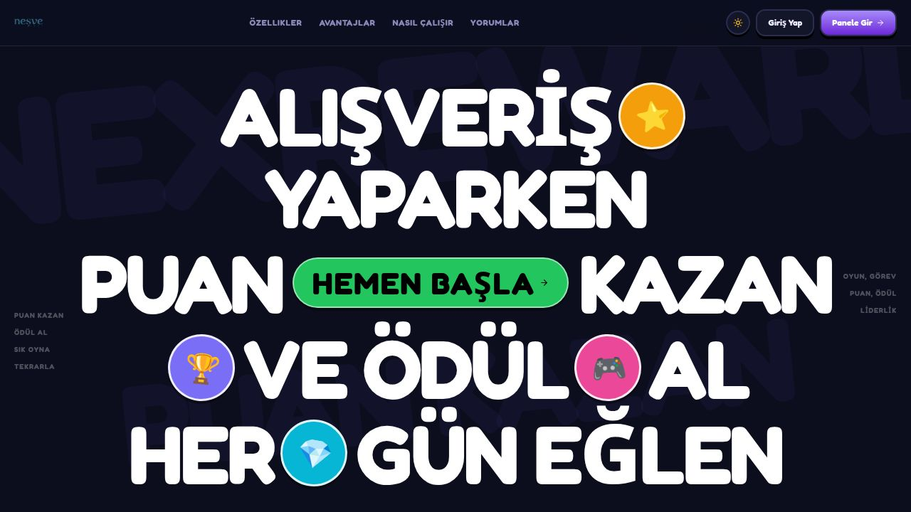

---

### 🔐 Login Page
Unified login/sign-up page with Google OAuth button, email/password fields, animated transitions between tabs. Mobile-first card design centered on the page.

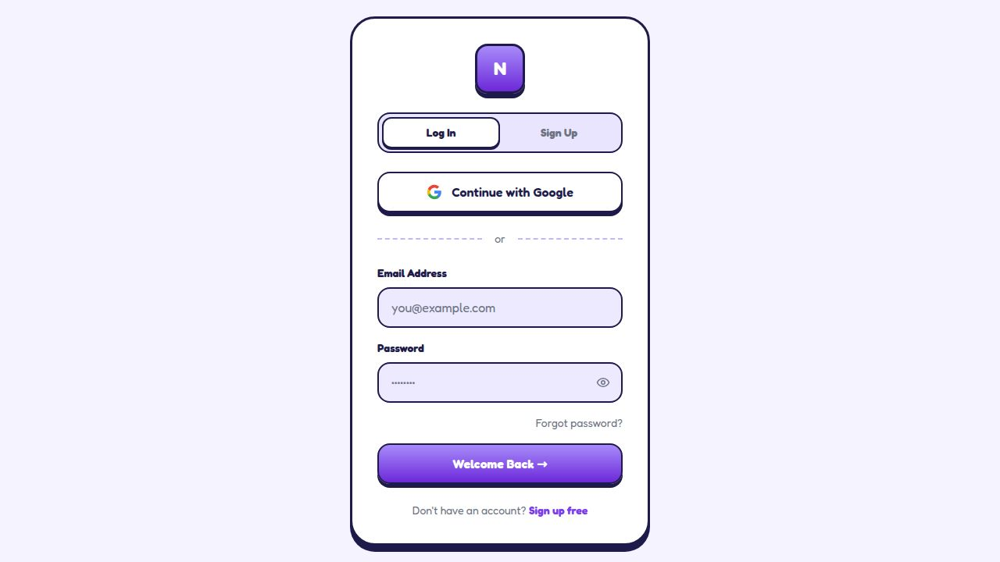

---

### 📝 Registration
Sign-up form with username, email, password confirmation fields. Same card design as login with smooth tab switching.

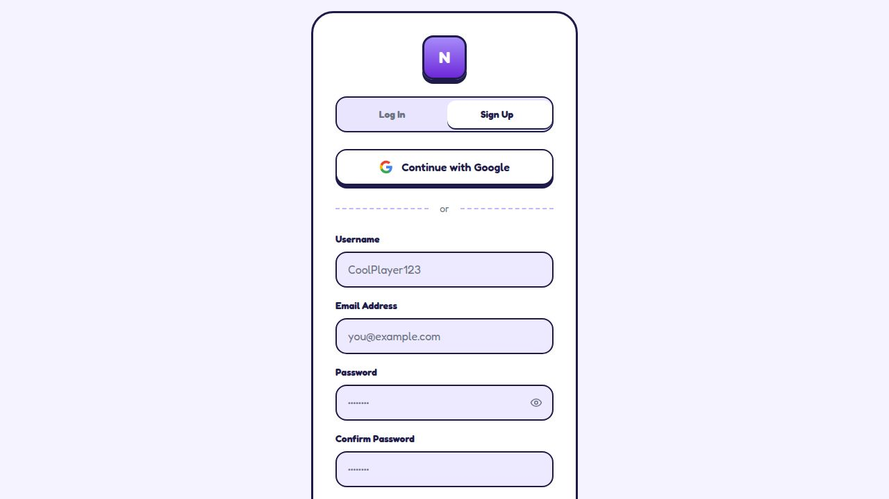

---

### 🏠 User Dashboard (Home)
Personalized welcome banner with current balance, level badge, XP progress bar. Quick-action cards and streak counter. Sidebar navigation with grouped sections.

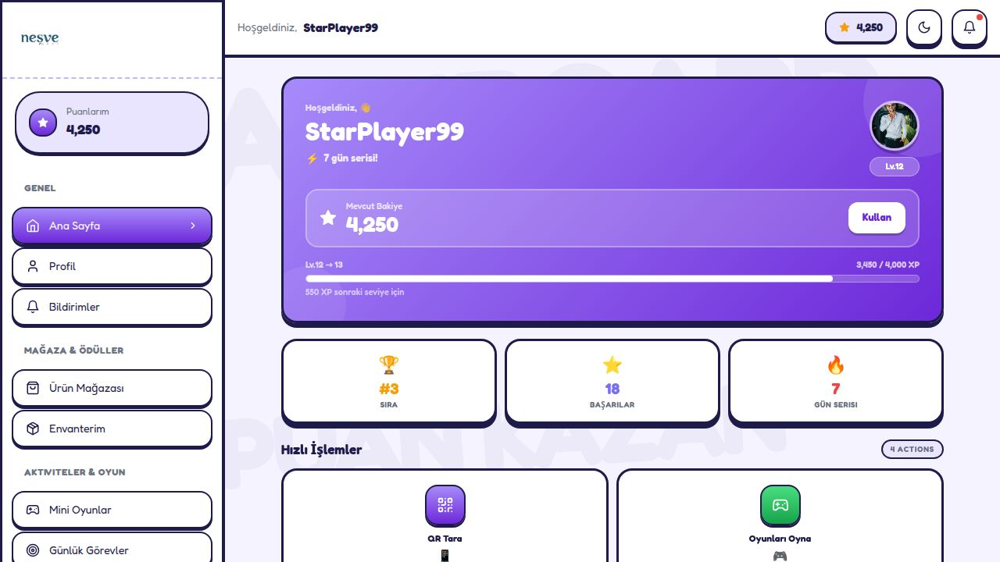

---

### 🎁 Rewards Shop
Point balance banner, search bar, category filter pills (Tümü / Kahve / Pastane / Yemek / İçecek). Product grid showing cover images, names, descriptions, and point costs.

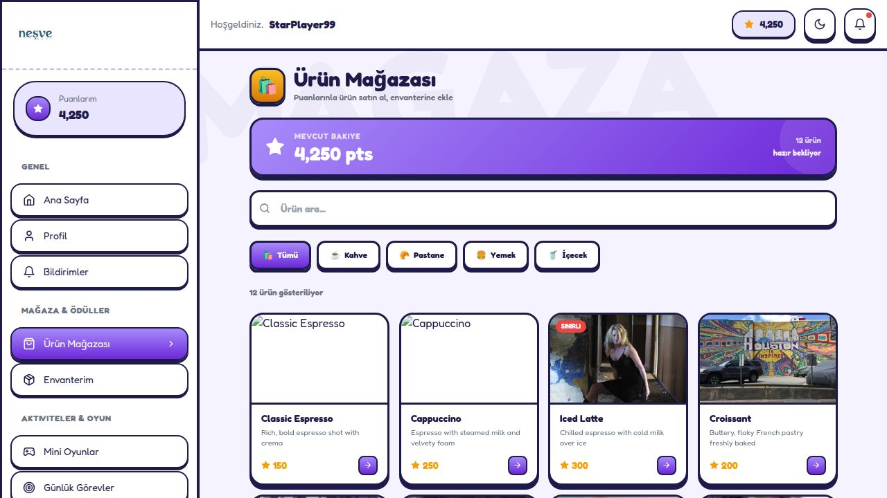

---

### 🎮 Mini Games
Game hub with four playable games: **Spin Wheel** (5–200 pts), **Memory Game** (50–200 pts), **Quiz** (0–125 pts), **Catch Game** (0–100 pts). Each has earn-range displayed.

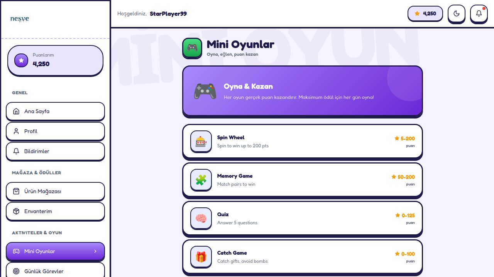

---

### 🏆 Leaderboard
Live seasonal tournament banner with countdown timer (days/hours/minutes/seconds). Prize pool showing 1st/2nd/3rd place rewards. Weekly, Monthly, All-Time tabs.

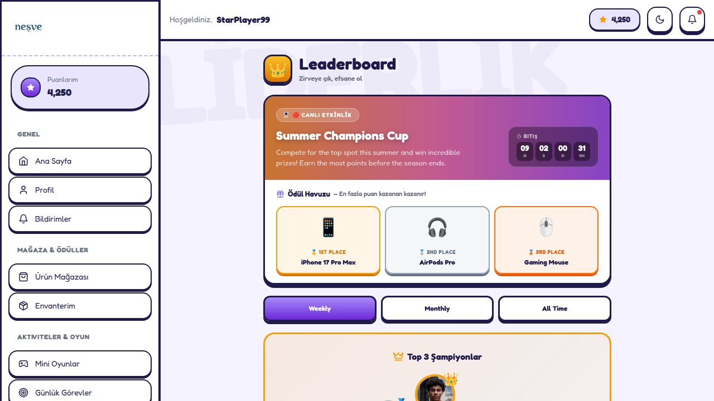

---

### 🥇 Achievements
Progress tracker (6/12 earned). Category filter chips. Achievement cards showing rarity badges (COMMON / RARE / EPIC), point rewards, and lock/unlock status.

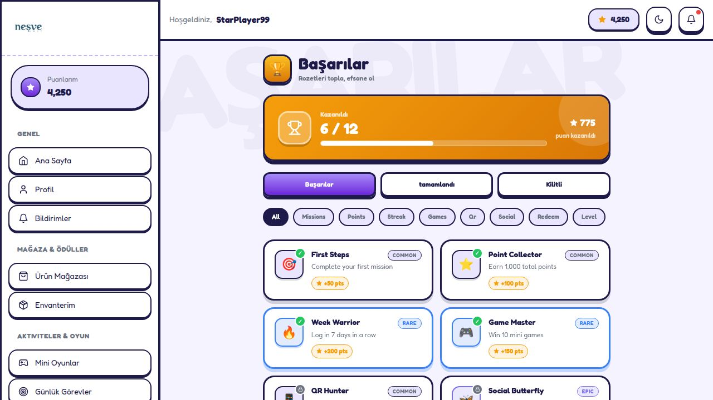

---

### 📋 Daily Missions (Görevler)
Daily/weekly mission tabs. Progress bar showing 2/5 completed. Mission list with checkmarks, point values, and a banner header image.

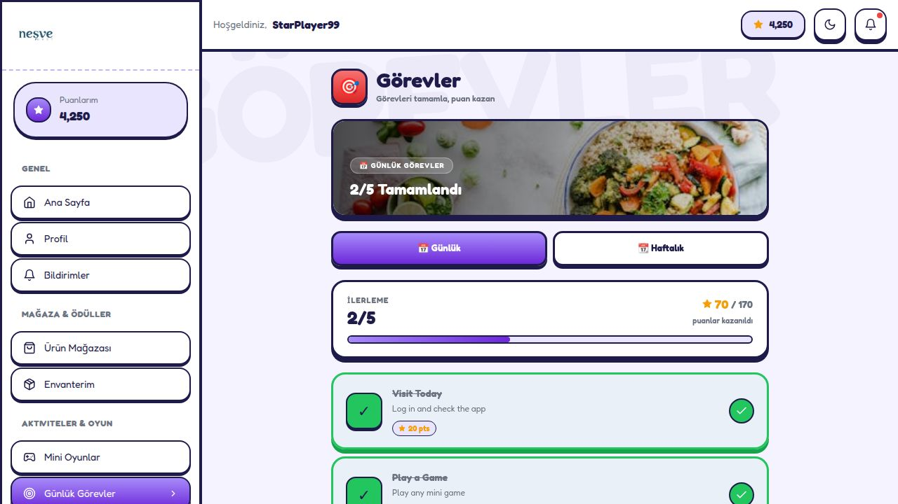

---

### 🚀 Progress Path (İlerleme Yolu)
Current level card (Level 12 – Şampiyon), XP progress bar with next-level target, stat cards for total XP, points, and levels cleared. Vertical timeline of all level rewards.

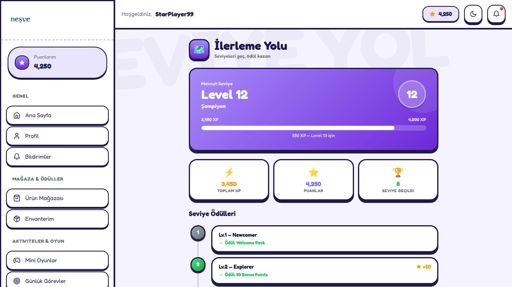

---

### 👤 User Profile
Avatar, username, member-since date, level badge, streak counter. Summary stat cards (total points, current level, achievements, streak). Spendable points with "Kullan" button.

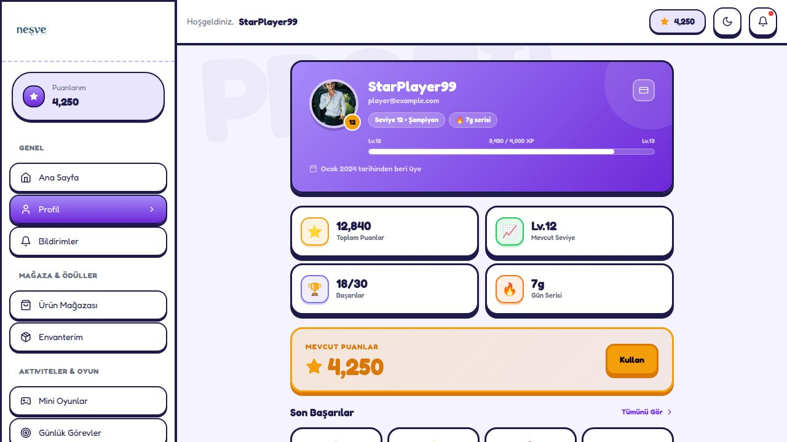

---

### 🛠️ Admin — Control Panel
Overview KPIs: 12,481 total users, 2,340 active today, 1.2M points issued, 3,892 rewards claimed. Weekly activity line chart, Quick Stats sidebar, and recent user list.

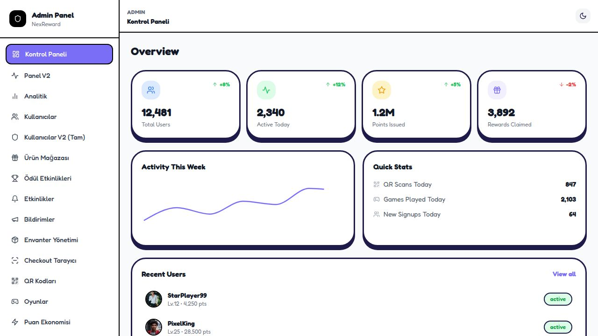

---

### 📊 Admin — Advanced Analytics
6 KPI tiles (active users, avg session, points/day, retention, revenue, security score). Monthly Active Users Growth dual-axis chart. Weekly Engagement by Type stacked bar chart (Games, Missions, QR Scans, Sessions).

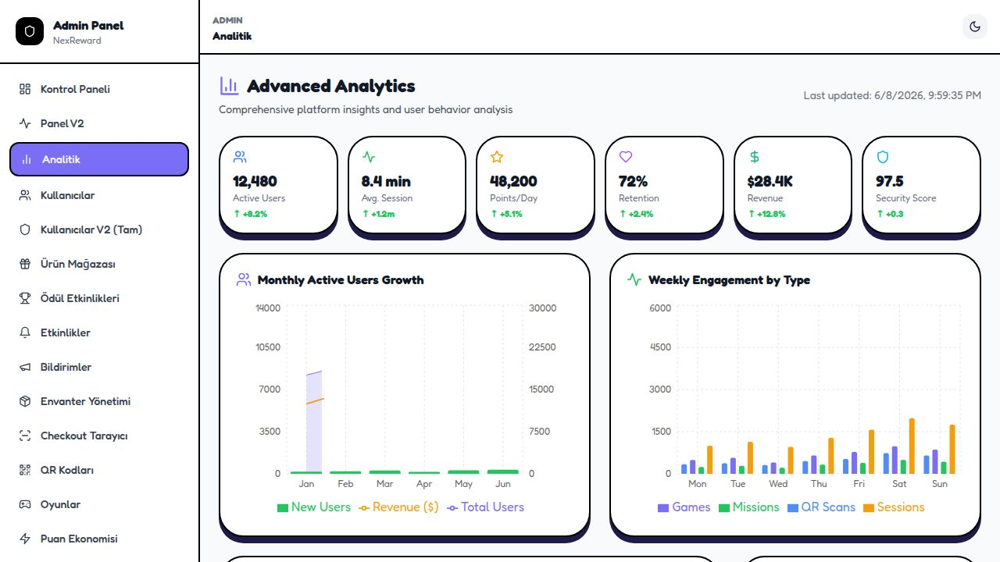

---

## Important Code Explained

### 1. Theme Object (`LandingPage.tsx`)
All landing page colors are derived from a single `t` object that computes values based on `isDark` state. This means a single `setIsDark` toggle re-renders every color in the page atomically with no class-toggling or CSS variable injection:

```tsx
const t = {
  pageBg:        isDark ? '#0c0e1e' : '#f0eeff',
  cardBg:        isDark ? '#131629' : '#ffffff',
  border:        isDark ? '#2a2d50' : '#1e1b4b',
  shadow:        isDark ? '#000000' : '#1e1b4b',
  textPrimary:   isDark ? '#f0edff' : '#1e1b4b',
  ghostColor:    isDark ? 'rgba(123,110,246,0.055)' : 'rgba(123,110,246,0.04)',
  // ... 14 total tokens
};
```

### 2. Infinite Ticker (`LandingPage.tsx`)
The `TickerStrip` component triplicates its items array and runs a pure CSS keyframe animation. Tripling (not doubling) ensures the loop is seamless even at very wide viewports:

```tsx
const TickerStrip = ({ items, direction, speed }) => {
  const tripled = [...items, ...items, ...items]; // 3x for seamless loop
  return (
    <div style={{ animation: `ticker${direction === 'left' ? 'Left' : 'Right'} ${speed}s linear infinite` }}>
      {tripled.map((item, i) => <div key={i}>{item.emoji} {item.text} ◆</div>)}
    </div>
  );
};
```

### 3. Neo-Brutalism SVG Shapes
All decorative card-corner shapes are inline SVG components. They are absolutely positioned at `top: -size*0.14, right: -size*0.14` so exactly 14% of the shape "peeks" from the corner — a consistent peek ratio regardless of size:

```tsx
const NBolt = ({ color, size = 94, opacity = 0.22, rotate = 0 }) => (
  <svg width={size} height={size} viewBox="0 0 48 48"
    style={{ position: 'absolute', top: -size * 0.12, right: -size * 0.12,
             opacity, transform: `rotate(${rotate}deg)`, zIndex: 0 }}>
    <polygon points="28,2 15,26 24,26 19,46 36,22 27,22"
      fill={color} stroke="#000" strokeWidth="3" strokeLinejoin="round" />
  </svg>
);
```

### 4. Stacking Banners (Sticky Scroll)
Each banner sits inside a tall outer `div` (the scroll lane) while the inner card has `position: sticky`. As you scroll, each card stacks on top of the previous one, offset by `top: ${62 + i * 8}px` so they fan out:

```tsx
{banners.map((b, i) => (
  <div style={{ height: 'clamp(280px, 52vh, 520px)', position: 'relative' }}>
    <div style={{
      position: 'sticky',
      top: `${62 + i * 8}px`,   // ← each card sits 8px lower than the last
      zIndex: 10 + i,            // ← later cards appear above earlier ones
      transform: `rotate(${b.rotate}deg)`,
    }}>
      ...banner content...
    </div>
  </div>
))}
```

### 5. Feature Card Cover Images
Cards have `padding: 0` with the image at the top (148px tall). The emoji badge uses `position: absolute; bottom: -20px` so it floats half-inside the image and half-inside the content area — creating a layered "sticker over photo" effect:

```tsx
<div style={{ position: 'relative', height: 148, overflow: 'hidden' }}>
  
  <div style={{ position: 'absolute', bottom: -20, left: 20,
    border: `2.5px solid ${f.color}`, boxShadow: `0 3px 0 ${f.color}80` }}>
    {f.emoji}
  </div>
</div>
```

### 6. Global State via Context (`AppContext.tsx`)
A single React Context holds all user state (points balance, level, XP, achievements, streak). Child components read via `useContext(AppContext)`. This means the point balance in the topbar, sidebar, and dashboard are always in sync with zero prop-drilling:

```tsx
export const AppContext = createContext<AppContextType>({} as AppContextType);
export const AppProvider = ({ children }) => {
  const [points, setPoints] = useState(4250);
  const [level, setLevel]   = useState(12);
  const [xp, setXp]         = useState(3450);
  // ... addPoints(), spendPoints(), etc.
  return <AppContext.Provider value={{ points, level, xp, addPoints, spendPoints }}>
    {children}
  </AppContext.Provider>;
};
```

### 7. QR / Barcode Scanner (`AdminCheckout.tsx`)
Camera frames are captured onto a hidden `<canvas>` every 200ms. Two parallel scanners run: **jsQR** for QR codes and **@zxing/browser** for 1D barcodes. Whichever resolves first wins, stops the camera, and fires the result:

```tsx
const imageData = ctx.getImageData(0, 0, canvas.width, canvas.height);

// QR path
if (scanType !== 'barcode') {
  import('jsqr').then(({ default: jsQR }) => {
    const qr = jsQR(imageData.data, imageData.width, imageData.height);
    if (qr?.data) { stopCamera(); resolve(qr.data, 'qr'); }
  });
}

// Barcode path
if (scanType !== 'qr') {
  import('@zxing/browser').then(({ BrowserMultiFormatReader }) => {
    const reader = new BrowserMultiFormatReader();
    reader.decodeFromImageUrl(dataUrl).then(result => {
      stopCamera(); resolve(result.getText(), 'barcode');
    });
  });
}
```

### 8. Responsive Typography with `clamp()`
All headline sizes use CSS `clamp(min, preferred, max)` so the font scales fluidly with the viewport — no breakpoint jumps:

```tsx
fontSize: 'clamp(52px, 14vw, 180px)'   // hero headline
fontSize: 'clamp(28px, 5vw, 60px)'     // section titles
fontSize: 'clamp(13px, 1.5vw, 17px)'   // body copy
```

---

## Routing Map

| Path | Page | Access |
|---|---|---|
| `/` | Landing Page | Public |
| `/login` | Login / Sign Up | Public |
| `/register` | Register redirect | Public |
| `/home` | User Dashboard | User |
| `/profile` | Profile | User |
| `/shop` | Rewards Shop | User |
| `/games` | Mini Games | User |
| `/leaderboard` | Leaderboard | User |
| `/achievements` | Achievements | User |
| `/missions` | Daily Missions | User |
| `/progress` | Progress Path | User |
| `/inventory` | Inventory | User |
| `/qr` | QR Scanner | User |
| `/events` | Seasonal Events | User |
| `/notifications` | Notifications | User |
| `/history` | Transaction History | User |
| `/settings` | Settings | User |
| `/support` | Support | User |
| `/stats` | User Stats | User |
| `/admin` | Admin Dashboard | Admin |
| `/admin/analytics` | Advanced Analytics | Admin |
| `/admin/users` | User Management | Admin |
| `/admin/rewards` | Reward Management | Admin |
| `/admin/games` | Games Config | Admin |
| `/admin/events` | Events | Admin |
| `/admin/notifications` | Push Notifications | Admin |
| `/admin/qr` | QR Generator | Admin |
| `/admin/checkout` | POS Checkout Scanner | Admin |
| `/admin/inventory` | Inventory Mgmt | Admin |
| `/admin/points-economy` | Points Economy | Admin |
| `/admin/audit-logs` | Audit Logs | Admin |
| `/admin/dashboard-v2` | Dashboard V2 | Admin |
| `/admin/users-v2` | Users V2 | Admin |
| `/admin/reward-events` | Reward Events | Admin |
| `/no-connection` | No Connection Error | — |
| `/maintenance` | Maintenance | — |
| `*` | 404 Not Found | — |

---

## Running the Project

```bash
# Install dependencies
cd project && npm install

# Start development server (port 5000)
npm run dev

# Type-check without building
npm run typecheck

# Production build
npm run build
```

The dev server runs on **port 5000** with `host: '0.0.0.0'` and `allowedHosts: true` so it works correctly behind the Replit proxy.

---

## External Image Sources

| Source | Used For |
|---|---|
| `picsum.photos` | Feature card cover images, phone frame screenshots, lifestyle gallery |
| `pravatar.cc` | Testimonial user avatars |
| `via.placeholder.com` | Fallback placeholder images |

All image seeds are fixed (e.g. `picsum.photos/seed/lightning99/600/240`) so images remain consistent across reloads.

---

*NexReward — Türkiye'nin en hızlı büyüyen sadakat platformu. © 2026*
